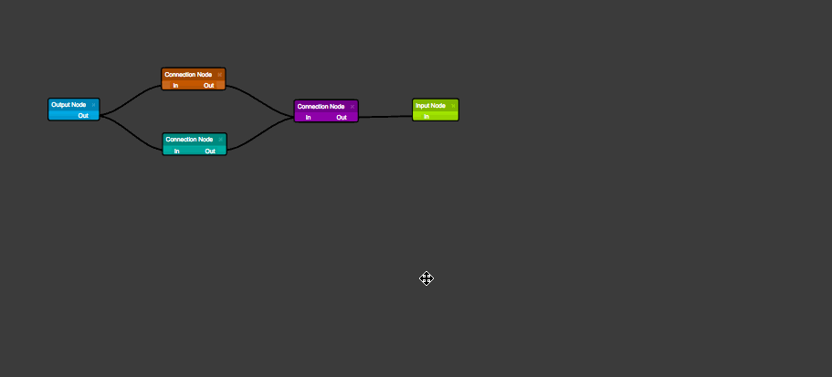

# React JS Diagrams

[](https://www.npmjs.com/package/react-js-diagrams)
[](https://www.npmjs.com/package/react-js-diagrams)


A React diagramming libary using lodash as its only additional dependency. Initially this project started as an ECMAScript / JSX port of the awesome [react-diagrams](https://github.com/projectstorm/react-diagrams)@2.3.6 repository by dylanvorster. It has since diverged with different features and goals. If you like TypeScript or a non JSX approach, check out the original repository.

## How To Install

```
npm install --save react-js-diagrams
```
or
```
yarn add react-js-diagrams
```

The above assumes that you are using [npm](http://npmjs.com/) with a module bundler like [Webpack](http://webpack.github.io/) or [Browserify](http://browserify.org/) in order to consume [CommonJS modules](http://webpack.github.io/docs/commonjs.html).

## Viewing The Examples / Developing

From the repository directory, ensure you've run `npm install` then run `npm start` to spin up the development server and navigate to `http://localhost:3000`.

Alternatively, you can run `./node_modules/.bin/webpack` from the repository directory to build the demo bundles and run them from the file system.

## How Does It Work

The library uses a Model Graph to represent the virtual diagram and then renders the diagram using
2 layers:
* Node Layer -> responsible for rendering nodes as React components
* Link Layer -> responsible for rendering links as SVG paths

Each node and link is fed into a factory that then generates the corresponding node or link React widget. This allows for deep customization when creating your own nodes. Browse the demos directory to learn how to create your own custom nodes (see __demo3__ or __demo4__).

__Demo 3 Custom Node:__


## Events

The RJD Diagram Widget utilizes a standard onChange to capture events.

```javascript
class MyDiagram extends React.Component {
  onChange(model, action) {
    console.log(model) // Serialized diagramModel
    console.log(action) // Object containing the event type and returned properties
  }

  render() {
    return <RJD.DiagramWidget diagramEngine={diagramEngine} onChange={this.onChange.bind(this)} />;
  }
}
```

### Action Types And Return Properties

---

__items-drag-selected__ -> Array items (NodeModel | LinkModel)

__items-moved__ -> Array items (NodeModel | LinkModel)

__items-selected__ -> NodeModel model, Array items (NodeModel | LinkModel)

__items-select-all__ -> Array items (NodeModel | LinkModel)

__items-deselect-all__ -> Array items (NodeModel | LinkModel)

__items-deleted__ -> Array items (NodeModel | LinkModel | PointModel)

__items-copied__ -> Array items (NodeModel | LinkModel)

__items-pasted__ -> Array items (NodeModel | LinkModel)

__link-created__ -> PointModel model

__link-selected__ -> LinkModel model

__link-deselected__ -> LinkModel model, Array items (NodeModel | LinkModel)

__link-connected__ -> LinkModel linkModel, PortModel portModel

__node-selected__ -> NodeModel model

__node-deselected__ -> NodeModel model, Array items (NodeModel | LinkModel)

__node-moved__ -> NodeModel model

__point-created__ -> PointModel model

__point-selected__ -> PointModel model

__point-deselected__ -> PointModel model

__canvas-drag__ -> event

__canvas-shift-select__ -> event

__canvas-click__ -> event

## Keyboard / Mouse Commands

__Delete__ removes any selected items


__Shift + Mouse Drag__ triggers a multi-selection box


__Shift + Mouse Click__ selects the item (items can be multi-selected)


__Mouse Drag__ drags the entire diagram


__Mouse Wheel__ zooms the diagram in / out


__Click Link + Drag__ creates a new link point


__Click Node Port + Drag__ creates a new link


__Ctrl or ⌘ + C__ copy any selected items; note that only links that belong to a selected source node will
be copied to the internal clipboard

__Ctrl or ⌘ + V__ paste items previously copied to the internal clipboard

__Ctrl or ⌘ + A__ select all items

__Ctrl or ⌘ + D__ deselect all items

## Disable Actions / Key Commands

The diagram widget accepts an `actions` property which is an object containing specific keys with boolean values that disable / enable the given action. If a specific key isn't passed it will be enabled by default (passing null will disable all actions).

#### Example

The following example disables the keyboard commands listed in the below `actions` prop.

```javascript
render() {
  return (
    <RJD.DiagramWidget
      diagramEngine={engine}
      actions={{
        deleteItems: false,
        copy: false,
        paste: false,
        selectAll: false,
        deselectAll: false
      }}
    />
  );
}
```

#### Supported Keys


__deleteItems__ The deletion of items via delete keypress

__selectItems__ The ability to select any item,

__moveItems__ The ability to move items,

__multiselect__ Shift selecting items,

__multiselectDrag__ Multiselect box selection of items,

__canvasDrag__ Dragging the canvas to move items,

__zoom__ Zoom in / out by mouse wheel,

__copy__ Copy items keyboard command,

__paste__ Paste items keyboard command,

__selectAll__ Select all keyboard command,

__deselectAll__ Deselect all keyboard command
